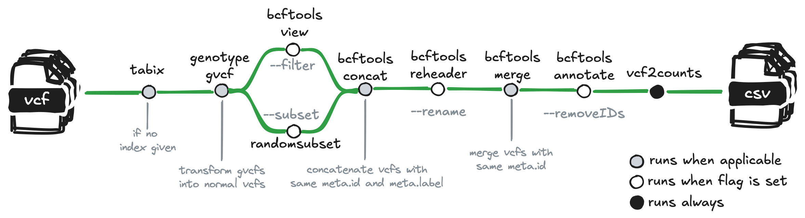

# qbic-pipelines/vcftocounts

[](https://github.com/qbic-pipelines/vcftocounts/actions/workflows/ci.yml)
[](https://github.com/qbic-pipelines/vcftocounts/actions/workflows/linting.yml)[](https://doi.org/10.5281/zenodo.14616650)
[](https://www.nf-test.com)

[](https://www.nextflow.io/)
[](https://github.com/nf-core/tools/releases/tag/3.3.1)
[](https://docs.conda.io/en/latest/)
[](https://www.docker.com/)
[](https://sylabs.io/docs/)
[](https://cloud.seqera.io/launch?pipeline=https://github.com/qbic-pipelines/vcftocounts)

## Introduction

**qbic-pipelines/vcftocounts** is a bioinformatics pipeline that processes g.vcf files to a matrix suitable for downstream analysis. The pipeline is built using [Nextflow](https://www.nextflow.io/) and processes data using the following steps:

1. Indexes (g.)vcf files ([`tabix`](http://www.htslib.org/doc/tabix.html))
2. Converts g.vcf files to vcf with `genotypegvcf` ([`GATK`](https://gatk.broadinstitute.org/hc/en-us))
3. Filters the VCF based on a string given to the `filter` param with `bcftools/view` ([`bcftools`](https://samtools.github.io/bcftools/bcftools.html)) - Turned off by default.
4. Concatenates all vcfs that have the same id and the same label with `bcftools/concat` ([`bcftools`](https://samtools.github.io/bcftools/bcftools.html))
5. Changes the sample name in the vcf file to the filename with `bcftools/reheader` ([`bcftools`](https://samtools.github.io/bcftools/bcftools.html)) - This can be turned off by adding `--rename false` to the `nextflow run` command.
6. Merges all vcfs from the same sample with `bcftools/merge` ([`bcftools`](https://samtools.github.io/bcftools/bcftools.html))
7. Removes entries in the ID column with `bcftools/annotate` ([`bcftools`](https://samtools.github.io/bcftools/bcftools.html)) - his can be turned off by adding `--removeIDs false` to the `nextflow run` command.
8. Converts the (merged) vcfs to a matrix using a custom R script written by @ellisdoro ([`R`](https://www.r-project.org/))
9. Collects all reports into a MultiQC report ([`MultiQC`](http://multiqc.info/))



## Usage

> [!NOTE]
> If you are new to Nextflow and nf-core, please refer to [this page](https://nf-co.re/docs/usage/installation) on how to set-up Nextflow. Make sure to [test your setup](https://nf-co.re/docs/usage/introduction#how-to-run-a-pipeline) with `-profile test` before running the workflow on actual data.

First, prepare a samplesheet with your input data that looks as follows:

`samplesheet.csv`:

```csv
sample,label,gvcf,vcf_path,vcf_index_path
SAMPLE-1,pipelineA-callerA,false,path/to/vcf.gz,path/to/.vcf.gz.tbi
SAMPLE-1,pipelineB-callerA,false,path/to/vcf.gz,path/to/.vcf.gz.tbi
SAMPLE-2,pipelineB-callerB,true,path/to/g.vcf.gz,path/to/g.vcf.gz.tbi
SAMPLE-2,pipelineB-callerB,true,path/to/g.vcf.gz,path/to/g.vcf.gz.tbi
```

Each row represents a VCF file coming from a sample. The `label` column enables concatenation of vcfs (for example when the pipeline produces different vcfs for chrM and chrY). The `gvcf` column indicates whether the file is a g.vcf file or not. The `vcf_path` and `vcf_index_path` columns contain the path to the VCF file and its index, respectively.

Now, you can run the pipeline using:

```bash
nextflow run qbic-pipelines/vcftocounts \
   -profile <docker/singularity/.../institute> \
   --input samplesheet.csv \
   --genome GATK.GRCh38 \
   --outdir <OUTDIR>
```

> [!WARNING]
> Please provide pipeline parameters via the CLI or Nextflow `-params-file` option. Custom config files including those provided by the `-c` Nextflow option can be used to provide any configuration _**except for parameters**_; see [docs](https://nf-co.re/docs/usage/getting_started/configuration#custom-configuration-files).

## Credits

qbic-pipelines/vcftocounts was originally written by Famke Bäuerle, Dorothy Ellis.

We thank the following people for their extensive assistance in the development of this pipeline:


## Contributions and Support

If you would like to contribute to this pipeline, please see the [contributing guidelines](.github/CONTRIBUTING.md).

## Citations

If you use qbic-pipelines/vcftocounts for your analysis, please cite it using the following doi: [10.5281/zenodo.14616650](https://doi.org/10.5281/zenodo.14616650)

<!-- TODO nf-core: Add bibliography of tools and data used in your pipeline -->

An extensive list of references for the tools used by the pipeline can be found in the [`CITATIONS.md`](CITATIONS.md) file.

This pipeline uses code and infrastructure developed and maintained by the [nf-core](https://nf-co.re) community, reused here under the [MIT license](https://github.com/nf-core/tools/blob/main/LICENSE).

> **The nf-core framework for community-curated bioinformatics pipelines.**
>
> Philip Ewels, Alexander Peltzer, Sven Fillinger, Harshil Patel, Johannes Alneberg, Andreas Wilm, Maxime Ulysse Garcia, Paolo Di Tommaso & Sven Nahnsen.
>
> _Nat Biotechnol._ 2020 Feb 13. doi: [10.1038/s41587-020-0439-x](https://dx.doi.org/10.1038/s41587-020-0439-x).
